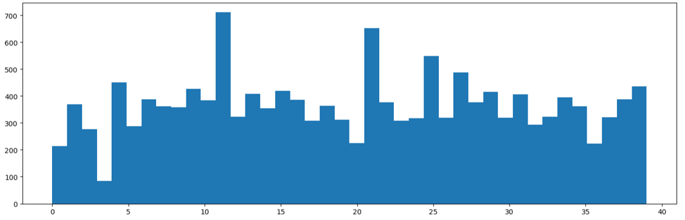
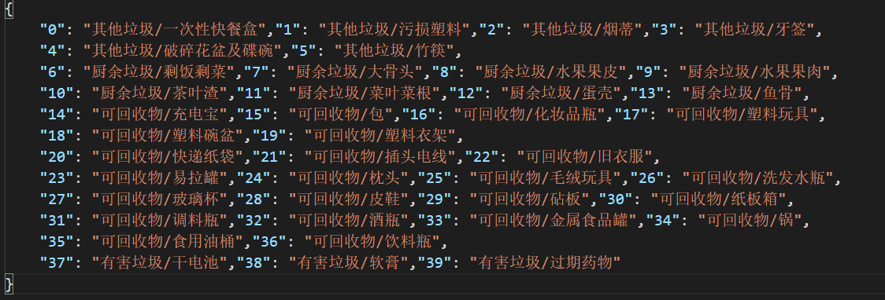
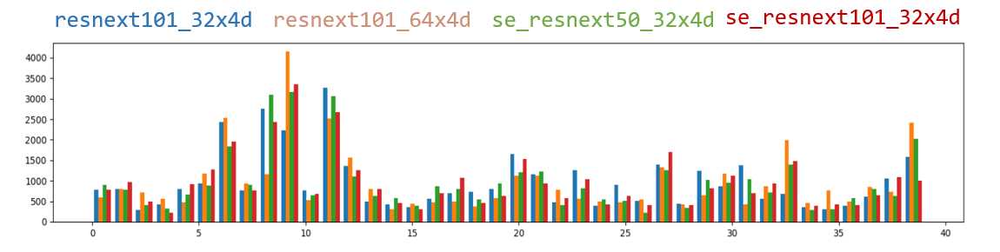
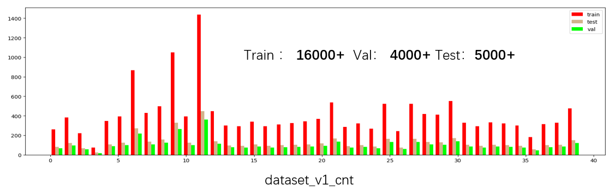
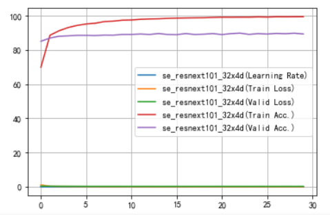
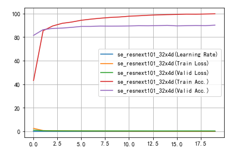

# Huaweiyun Garbage Classify Learning
 The topic was from huawei cloud garbage classification competition. 
 To learn how to use pytorch and test the effect of the backbone(Resnet, ResNext, Se_ResNext, etc).
 
 The project is only for learning, and i'm have not paticipate in that competition.

 ## Dataset
 In order to better experience the learning process, I also extended the dataset by downloading pictures of corresponding categories at Google and Baidu.

### raw dataset

### mydataset
I used some models to overfit the original training data, and then used those models to distinguish the new additions.

and the first version of mydataset

And then there are a lot of problems with the data set that haven't been solved very well, so I'll offer both the original data set and my data set.

- [raw_dataset(garbage_classify_v2.zip)](https://modelarts-competitions.obs.cn-north-1.myhuaweicloud.com/garbage_classify/dataset/garbage_classify_v2.zip) in official website
- [mydataset_v1](https://pan.baidu.com/s/1fzTWS5dVhEYHT9pLLZwn9A) in BaiduYun

## Models
The model was finally used Se_ResNext101_64x4d pretrained in imagenet.

For better performance, i alos use [CBAM](https://arxiv.org/pdf/1807.06521.pdf
) and [FocalLoss](https://arxiv.org/pdf/1708.02002.pdf
) Module to help training.

### TODOS
- [ ] feature extractor
- [ ] organize the code
- [x] test model  

### requirements
- pytorch 1.3.1 or above
- numpy
- PIL
- [pretrainedmodels](https://github.com/Cadene/pretrained-models.pytorch)

## Results
Since the equipment I can use is limited, the test data I conducted are for reference only!

Model | Train Acc | Val Acc | Test Acc
-|-|-|-
se_resnext101_32x4d + ce | 0.9825 | 0.9005 | 
se_resnext101_32x4d + fc | 0.9920 | 0.8986 | 
se_resnext101_32x4d + cbam + fc | 0.9993 | 0.9032 | 0.9005

se_resnext101_32x4d + fc

se_resnext101_32x4d + cbam + fc

